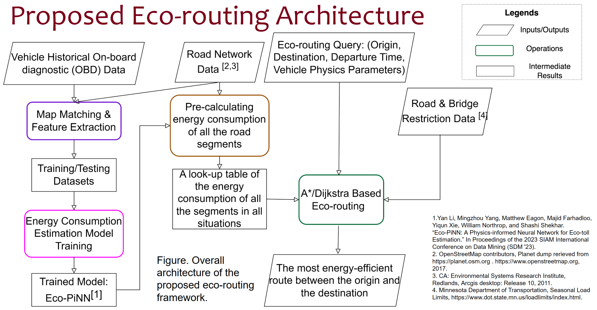

# ecoRouting
This is project of eco-efficient path selection given an origin/destination pair and a bounding box.

## Environments:

The code works well with [python](https://www.python.org/) 3.8.8, 
[pytorch](https://pytorch.org/) 1.8.1, 
and **[osmnx](https://github.com/gboeing/osmnx)  0.16.1**.

tqdm, bintrees, plotly are also required

Some scripts (for map matching) require cygwin and python 2.7

## Pipeline:
   

